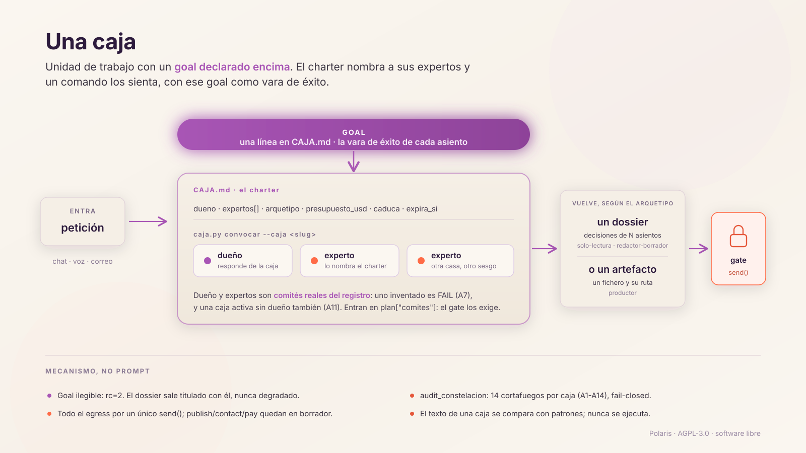

# 🧭 Polaris

> *«El objetivo de Polaris es tener el mejor sistema agéntico para trabajar con mi diagnóstico.»*
>
> — la ingeniera que lo construyó, paciente con cáncer metastásico

[](https://github.com/BeyondTheProtocol/polaris/actions/workflows/contribuciones.yml)
[](LICENSE)
[](https://www.python.org/)
[](#-arrancar)

Polaris tiene cuatro piezas:

| | Pieza | Qué es |
|---|---|---|
| 🚪 | **Entrada** | Un solo sitio donde soltar lo que hace falta: por chat, por voz o por correo. Nadie gestiona sesiones ni menús |
| 🎯 | **Goal** | Aquí es **NED**, *sin evidencia de enfermedad*: el estado clínico al que apunta cada decisión del sistema |
| 📦 | **Caja** | Convoca a los expertos que hacen falta para ese caso y junta lo que dicen en la mejor solución, la que más acerca al goal |
| 📤 | **Salida** | La forma que pida la tarea: un informe, una web, una app, una respuesta, o las preguntas correctas para el equipo médico |

El resto del repo es la maquinaria que hace que eso se cumpla **por código**: que el goal no se
pierda por el camino, que nada salga al mundo sin permiso y que una caja sin misión se retire
sola.

**No da consejo médico ni diseña tratamientos.** Prepara la evidencia y ordena el caso para que
el equipo médico pueda decidir mejor y antes.

---

## 🎯 Por qué existe

Polaris nació para sostener la investigación clínica de **una paciente con cáncer metastásico**
que decidió no esperar sentada: leer la literatura, ordenar su propio perfil molecular y llegar
a un tratamiento personalizado por la vía más rápida que sea segura.

En ese contexto, **equivocarse de pregunta cuesta meses**, y los meses son exactamente lo que
no hay. De ahí salen tres problemas que este repo intenta resolver de verdad:

| Problema | Qué pasa sin sistema | Qué hace Polaris |
|---|---|---|
| 🎯 **El objetivo se diluye** | Cada conversación con una IA empieza de cero y acaba en un resumen bonito que no acerca a nada | Cada trabajo nace con un **goal escrito**, y el goal titula el resultado |
| 🧠 **Una sola opinión no basta** | Un modelo responde rápido y con seguridad, también cuando se equivoca | Se convoca un **comité** de roles distintos, con verificación adversarial y evidencia graduada |
| 🚪 **Un error hacia fuera no se deshace** | Un correo enviado, un dato publicado, un pago hecho | **Una única puerta de salida** con gate humano: todo nace en borrador |

Cada decisión se filtra por la misma pregunta: *¿esto acerca a NED?* Lo que no pasa ese filtro
se queda fuera.

> 💡 **¿Y si tu caso no es este?** El patrón sirve para cualquier objetivo difícil con plazo:
> una tesis, una investigación, un trámite legal largo, el cuidado de un familiar. Lo que se
> publica aquí es el **arnés**, no el caso.

## 📣 Por qué este repo es público

**Está abierto para que Polaris mejore, y para que esa mejora acorte el camino a NED.** Es el
motivo principal.

Un sistema que sostiene un caso clínico y solo se mira a sí mismo acumula puntos ciegos. Abrirlo
es la forma más barata de que alguien de fuera diga «ese método de verificación tiene un
agujero», «para eso hay un modelo mejor» o «ese ensayo lo estáis buscando en el sitio
equivocado». Cada una de esas frases puede valer semanas, y las semanas son justo lo que no
sobra.

Así que si entras, **entra a romperlo**: [docs/enrutado-modelos.md](docs/enrutado-modelos.md)
tiene las preguntas abiertas sobre modelos con el caso clínico delante, y
[docs/agentes.md](docs/agentes.md) explica quién hace qué y dónde falla el reparto. Un issue
bien argumentado ayuda más que cien commits.

Si además le sirve a alguien que está pasando por algo parecido, mejor todavía 💜

---

## 🔄 Cómo funciona

Una **caja** es una unidad de trabajo con un goal declarado encima: dentro se convoca a los
expertos que hacen falta para acercarse a ese goal, y lo que sale pasa por una única puerta con
aprobación humana.

> **Un ejemplo:** «necesito un render 3D de mis lesiones a partir
> de mis PET, para que mis médicos las vean mejor». La persona pone el **qué**; la caja decide el
> **cómo** y el **quién**: qué visor, qué perfil analiza las imágenes, a quién se convoca. El
> filtro es siempre el mismo, *¿esto ayuda a que los médicos entiendan mejor la enfermedad?* Si
> la respuesta es sí, acerca a NED. Y si la tarea pide **modo plan**, la caja pregunta todo lo
> necesario antes de ponerse a ejecutar: mejor una pregunta de más que un resultado a medias. Aquí la
> salida es el propio render.

```
petición ──> GOAL ──> CAJA.md ──> expertos ──> salida
             NED, el   el goal    los que      informe · web · app ·
             estado    y el       saben de     respuesta · preguntas
             que manda contrato   esto         (gate humano)
```

Cada flecha es un fichero que puedes leer:

| Paso | Fichero | Qué hace |
|---|---|---|
| 🧭 Enrutar | `tools/decide_peticion.py` | Decide quién responde: la sesión sola, un LLM externo, un comité o un panel |
| 📜 Charter | `Constelacion/<slug>/CAJA.md` | `## Goal`, dueño, expertos, arquetipo, presupuesto, cuándo caduca |
| 🪑 Convocar | `tools/caja.py convocar` | Sienta al dueño y a sus expertos, con el goal como vara de éxito |
| 📦 Salida | `tools/caja.py dossier` | Junta lo que dijeron todos en la forma que toque (dossier, borrador, artefacto), titulada con el goal |
| 🚪 Salir | `tools/salida.py` | La única puerta al mundo. Todo egress pasa por `send()` |
| 🔍 Auditar | `tools/audit_constelacion.py` | 14 cortafuegos por charter, fail-closed |



<details>
<summary>📋 Una convocatoria real, tal cual se ve</summary>

```
CAJA «donaciones-directas» — convocatoria. Ejecútala ANTES de responder.
  🎯 GOAL: Que la gente pueda apoyar la causa donando directamente, de forma legal y transparente.
  🧭 Zona autónoma (redactor-borrador): investiga y deja BORRADORES. No envía, no publica.
  🚪 Nada hacia fuera sin OK: publicar, contactar o pagar pasa por tools/salida.py.

  1. Agent(subagent_type="finanzas-transparencia")  — dueño.
  2. Agent(subagent_type="legal-burocracia")  — experto.
  🧺 Cierra con: python3 tools/caja.py dossier --caja donaciones-directas
```
</details>

### 🧠 Qué modelos hay detrás

Polaris no depende de un solo modelo. `tools/enruta.py` elige entre **8 puertas**, y hay una
regla por encima de todas: **lo sensible no sale del Mac**.

| Puerta | Casa | Para qué | ¿Ve lo sensible? |
|---|---|---|---|
| 🏠 Local (ollama) | Alibaba (Qwen3 8B) | De-identificar y clasificar, sin salir del Mac | ✅ único destino del dato crudo |
| 🟣 Claude | Anthropic | Razonar, y todo lo que toca el caso | ✅ |
| ⚫ Grok | xAI | Rastrear X, foros y lo que no está en los índices limpios | ❌ |
| 🔵 Perplexity | Perplexity, y modelos de otras casas con la misma clave | Buscar con fuentes citadas | ❌ |
| 🟠 ChatGPT | OpenAI | Segunda voz del panel | ❌ |
| 🔷 Gemini | Google | Tercera voz del panel, contexto largo | ❌ |
| 🟩 NVIDIA | NVIDIA, y modelos abiertos como DeepSeek, Kimi, GLM o Yi | Volumen y tareas mecánicas, gratis | ❌ nunca |
| 🟨 GLM | Zhipu | Alternativa barata, hoy sin saldo | ❌ nunca |

Lo que decide es **dónde corre** el modelo. Qwen es chino y es el único que ve el dato crudo,
porque corre sin conexión en el propio Mac. DeepSeek, Kimi o GLM, servidos desde la
nube, no ven nada del caso.

Para evidencia médica, antes que cualquier LLM van scite, PubMed, biomcp y cbioportal. Modelos
exactos, versiones y motivos: [docs/enrutado-modelos.md](docs/enrutado-modelos.md).

---

## ⚡ Arrancar

**Requisitos:** macOS (hay dependencias nativas: `ocrmac`, `launchd`) · Python 3.9+

```bash
git clone https://github.com/BeyondTheProtocol/polaris.git && cd polaris
python3 -m venv .venv && .venv/bin/pip install -r requirements.txt
export BTP_REPO="$PWD"
export BTP_STATE_DIR="$PWD/tools/state"
git config core.hooksPath tools/githooks
bash tests/test_all.sh          # en Linux o CI: BTP_PORTABLE=1 bash tests/test_all.sh
```

> ⚠️ **Nada arranca solo.** Los `launchd` de `tools/launchd/` se instalan a mano, y
> `~/.btp.HALT` o un `.HALT` en la raíz frenan el lazo entero.

---

## 🛡️ Las cuatro garantías

**Las cuatro están en código y tienen tests**: ninguna depende de que el modelo haga caso.

1. 🎯 **El goal manda.** El `## Goal` del charter titula el dossier. Pedir una caja cuyo goal no
   se puede leer es un error (`rc=2`), no un dossier degradado en silencio.
2. 🚪 **Nada sale sin OK.** *«Nada hacia fuera sin OK explícito»* → `tools/salida.py`: decide el
   módulo, no el agente. Publicar, contactar o pagar se queda en borrador.
3. 🔒 **Fail-closed.** *«Ilegible = FALLO, nunca verde por defecto»*. Vale igual para un slug
   fuera de `[a-z0-9-]` que para una decisión sin fuente trazable.
4. 🧪 **Dato, no instrucción.** El texto de una caja *«jamás se ejecuta»*: solo se lee y se
   compara con patrones. Es la defensa anti-inyección.

Y una quinta que es de la caja, no del sistema: **`caduca` y `expira_si`**. Un charter declara
qué evento lo retira, y el auditor avisa cuando una caja vence y sigue viva. Sin zombis de
misión quemando presupuesto.

---

## 🙈 Lo que no está aquí

Este repo es un **espejo derivado** de uno privado. Se regenera entero con
`python3 tools/publicar.py <destino>`, que sustituye a la titular y a sus contactos por
marcadores y **aborta si algo vetado sobrevive** al barrido final.

- 📁 **El contenido.** `00_FUENTE-DE-VERDAD/` está en `.gitignore` y nunca entró en el
  historial: informes, correo, mensajería y las cajas reales viven solo en disco local.
- 🔍 **Los datos que los detectores buscan.** `zonas_clinicas.py`, `adjuntos_clinicos.py` y
  `subir_historial_drive.py` reconocen cuándo un documento es de la titular. Su lista de marcas
  vivía dentro del código, así que **el detector era la fuga**. Ahora vive en overlays
  `*.local.json` gitignored: los detectores se publican enteros y funcionan, y la lista la
  escribe cada cual en local.

---

## 🤝 Contribuir

👉 **Lee [CONTRIBUTING.md](CONTRIBUTING.md) entero antes de abrir nada.** Es corto y te ahorra
trabajo perdido. Lo esencial:

### Lo que más ayuda, por orden

| | Qué | Por qué |
|---|---|---|
| 🥇 | **Abrir un issue**: «esto que hacéis con X está mal, mirad Y» | Es lo más valioso y lo que menos cuesta revisar. Ábrelo aunque no tengas el arreglo |
| 🥈 | **Usarlo para tu caso y contar qué se rompió** | Si el arnés no encaja en otra enfermedad u otro contexto, ese reporte vale más que un PR |
| 🥉 | **Un PR pequeño y acotado**, con issue previo | Entra rápido porque se puede leer entero |

### 🧱 Lo que falta, por si quieres ir directo al grano

[docs/lo-que-falta.md](docs/lo-que-falta.md) son los **cinco problemas abiertos** del sistema,
con las cifras del repo delante y sin adornos: el carril local parado, demasiadas piezas sin
gestión de su ciclo de vida, la dependencia de un solo runtime, el contexto que se pierde entre
sesiones y las rutinas que se caen en silencio.

### 👥 ¿Te interesan los agentes y cómo se reparten el trabajo?

Los 34 agentes están publicados en `.claude/agents/`, uno por fichero, y
[docs/agentes.md](docs/agentes.md) explica quién es quién, qué reglas heredan todos y dónde una
mirada de fuera ayudaría más.

### 🧠 ¿Sabes de modelos, bioinformática o literatura médica?

Hay una lista de **preguntas abiertas** en [docs/enrutado-modelos.md](docs/enrutado-modelos.md):
qué modelo se usa hoy para cada tarea del caso, por qué se eligió, y dónde una opinión fundada
nos ahorraría semanas. Eso se responde con un issue, no con un PR.

### ⚠️ Antes de invertir una tarde, entiende esto

**Un merge hecho aquí se pierde en la siguiente regeneración**, porque el generador reescribe
el árbol entero. Un PR aceptado se aplica en el repo de origen con
`tools/pr_portar.py` y reaparece aquí en la siguiente publicación; el PR se cierra con
«aplicado en upstream». **Tu cambio entra en el sistema, tu commit no queda en este historial.**
Preferimos decirlo antes que después.

### ✅ Qué revisa el CI de tu PR

| Job | Qué mira |
|---|---|
| 🧹 `barrido y sintaxis` | `tools/ci_barrido.py` sobre tu diff: claves y tokens, correo personal, teléfono, DNI, alelos HLA, contenido de VCF, secuencias, variantes HGVS y rutas privadas. Más `compileall` |
| 🧪 `batería` | `BTP_PORTABLE=1 bash tests/test_all.sh` |

Si el barrido salta con un falso positivo, **dilo en el PR**: lo mira una persona, no se salta
el CI.

### 🚫 Lo que no va a entrar

- PRs grandes sin issue previo (se cierran sin revisar, por bien que estén).
- Refactors «de limpieza», cambios de estilo, migraciones de herramientas.
- Cualquier cosa que debilite el muro: el gate de salida, los hooks o los detectores.
- Datos reales de nadie en tests o fixtures. **Invéntatelos.**

> 🔐 Cada línea que entra se revisa a mano, una por una. Este arnés corre 24/7 en una máquina
> con acceso a correo, Drive y una carpeta clínica. Un parche mezclado sin
> leer se ejecuta ahí.

---

## 🩺 Lo que se vigila solo

Las cuatro corren solas, sin que nadie tenga que acordarse.

| Vigila | Qué hace | Dónde |
|---|---|---|
| 🧠 **Los modelos** | Cada 6 h comprueba que cada proveedor responde **de verdad** y separa «sin saldo» (hay que recargar) de «caído» (degrada solo). Avisa de una caída solo tras **dos pasadas seguidas**: un timeout suelto no es una avería | `tools/healthcheck.py::_check_llms` |
| 📦 **El catálogo** | Qué pieza está viva y cuál no la llama nadie, cruzando citas, daemons y último commit | `tools/inventario.py` |
| 👥 **Los agentes** | Cada ficha declara **cada cuánto** se espera que trabaje (`ritmo:`), y un test lo exige. Así un cero se puede leer: en un `a-demanda` es normal, en un `permanente` es alarma | `tests/test_agentes_ritmo.py` |
| 🔁 **El espejo** | Regenera este repo cada vez que cambia el sistema, y **no publica** si el barrido encuentra algo o el árbol no compila | `tools/publicar_sync.py` |

## 🙏 Gracias

Polaris mejora con lo que otras personas traen. Quien aporta algo sale aquí con su nombre, y
también en el código, junto a la pieza que nació de su idea.

- **[Marc Recio](https://github.com/Marc-Recio-Celda)**: la idea de que el modelo solo conteste
  preguntas de sí o no, una por señal, y que la jerarquía la decida el código. De ahí sale el
  nivel de evidencia determinista (`tools/tier_evidencia.py`).
- **Marcos Gorgojo**: una auditoría externa de arquitectura, seguridad y rigor clínico
  (22-sep-2026) que midió la distancia entre lo que Polaris promete y lo que el código
  demuestra. De ahí salen, entre otros, el permiso de envío firmado, el panel de alto riesgo
  que abre la fuente clínica en vez de fiarse de la cita (`tools/fuente_clinica.py`) y la
  entrega que no se repite (`tools/salida.py`).
- **[{{CONTACTO}} {{CONTACTO}}](https://contacto.com)**, con su agente KAI: una revisión de arquitectura,
  código y procesos (25-sep-2026) hecha sobre el propio repo, con la ruta y la línea de cada
  punto, y los fallos de seguridad por el canal privado. De ahí salen el listón numérico para
  pasar un check de avisar a bloquear, el vigilante de las rutinas fuera del Mac, los guards
  que deniegan si se quedan sin tiempo y la cadena de de-identificación medida, entre otros.

¿Has aportado algo y no sales? Escribe a `beyondtheprotocolteam@gmail.com`.

## 📊 Estado

En producción y en movimiento. A septiembre de 2026: unos 530 commits al mes, ~90.000 líneas
de código (Python, Shell y JavaScript) y ~43.000 de tests.

`tests/test_all.sh` se pone en rojo **a propósito** mientras haya deuda detectada y sin cerrar
(`python3 tools/deuda.py numero`): un fallo conocido no puede esconderse detrás de un verde. La
batería cambia de color a lo largo del día, y eso es lo esperado.

---

## 📄 Licencia

[AGPL-3.0](LICENSE) · [NOTICE](NOTICE) · [Acuerdo de contribución](ACUERDO-CONTRIBUCION.md)

En corto: **puedes usar y modificar Polaris libremente.** Si lo conviertes en parte de un
producto o servicio que ofreces a terceros, tienes que **publicar tu código derivado con la
misma licencia**. Eso es lo que hace la AGPL, y por eso se eligió.

Si eso no te encaja porque quieres integrarlo en algo cerrado, existe la otra puerta: pide una
**licencia comercial** a la titular en `beyondtheprotocolteam@gmail.com`, contando qué quieres
hacer. Las dos vías conviven: la AGPL seguirá siendo gratis para todo el mundo, siempre.

> ⚖️ Una licencia protege el **código**, no la idea. Cualquiera puede construir algo parecido
> partiendo de cero, y eso está bien: lo que no puede es coger esto, cerrarlo y venderlo.
